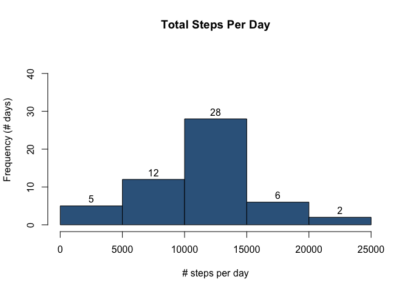
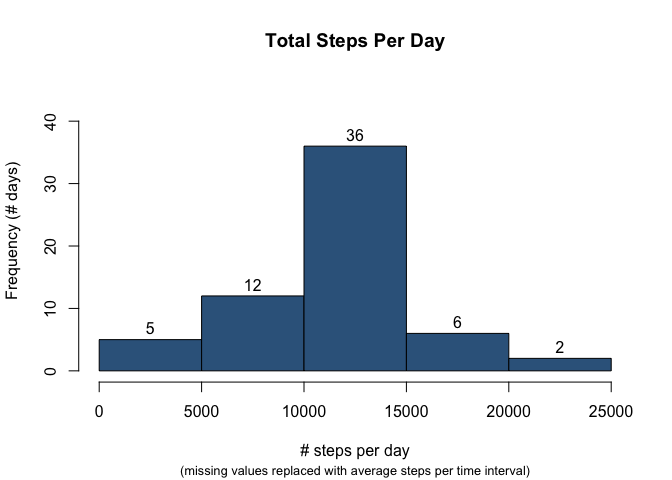
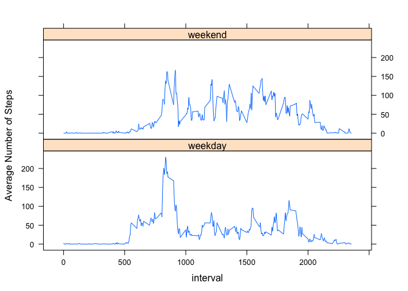

# Reproducible Research: Peer Assessment 1


## Loading and preprocessing the data

Load the raw data:

```r
setwd("~/Coursera/Reproducible Research/Assessment1/RepData_PeerAssessment1")
unzip("activity.zip", overwrite=TRUE)
activity <- read.csv("activity.csv")
```

Structure of the raw data:

```r
str(activity)
```

```
## 'data.frame':	17568 obs. of  3 variables:
##  $ steps   : int  NA NA NA NA NA NA NA NA NA NA ...
##  $ date    : Factor w/ 61 levels "2012-10-01","2012-10-02",..: 1 1 1 1 1 1 1 1 1 1 ...
##  $ interval: int  0 5 10 15 20 25 30 35 40 45 ...
```

Create a formatted version of the interval (HH:MM) and 
calculate the DateTime from date + HHMM interval:

```r
activity <- within(activity, {
    intervalCharTmp <- formatC(interval, width=4, flag="0")
    intervalChar <- paste(
        substr(intervalCharTmp,1,2), ":", substr(intervalCharTmp,3,4), 
        sep=""
    )
    intervalStart <- strptime(paste(date, intervalChar), format="%Y-%m-%d %H:%M")
    rm(intervalCharTmp)
})    
str(activity)
```

```
## 'data.frame':	17568 obs. of  5 variables:
##  $ steps        : int  NA NA NA NA NA NA NA NA NA NA ...
##  $ date         : Factor w/ 61 levels "2012-10-01","2012-10-02",..: 1 1 1 1 1 1 1 1 1 1 ...
##  $ interval     : int  0 5 10 15 20 25 30 35 40 45 ...
##  $ intervalStart: POSIXlt, format: "2012-10-01 00:00:00" "2012-10-01 00:05:00" ...
##  $ intervalChar : chr  "00:00" "00:05" "00:10" "00:15" ...
```


## What is mean total number of steps taken per day?

Note: this summary ignores NA data values.

```r
stepsPerDay <- with(activity, tapply(steps, date, sum))
hist(stepsPerDay,
    main="Total Steps Per Day",
    ylim=c(0,45),
    xlab="# steps per day",
    ylab="Frequency (# days)",
    labels=TRUE,
    col="steelblue4")
```

 

```r
meanStepsPerDay <- mean(stepsPerDay, na.rm=TRUE)
medianStepsPerDay <- median(stepsPerDay, na.rm=TRUE)
```

* average steps per day: 10766
* median steps per day: 10765

## What is the average daily activity pattern?

Calculate and plot the average number steps per interval (ignoring NAs):

```r
# Note: using the original numeric representation of the interval in order to
# create a time series using the plot function.
stepsPerInterval <- with(activity, 
    tapply(steps, interval, mean, na.rm=TRUE)
)

plot(names(stepsPerInterval), stepsPerInterval, type="l", 
     xlab="Time interval",
     ylab="Average #steps",
     main="Average #steps per interval")
```

 

Q: Which 5-minute interval, on average across all the days in the dataset, contains the maximum number of steps?

```r
maxSteps <- stepsPerInterval[order(stepsPerInterval, decreasing=TRUE)[1]]

# reformat the interval number as HH:MM.
maxNum <- as.numeric(names(maxSteps))          # convert to numeric
maxChar <- formatC(maxNum, width=4, flag="0")  # add leading zeros
maxChar <- paste(                              # insert the :
    substr(maxChar,1,2), ":", substr(maxChar,3,4), 
    sep=""
)
```

A: The 08:35 interval has the most steps on average (206 steps).


## Imputing missing values

How many missing values?

```r
nDateNA <- sum(is.na(activity$date))
nIntervalNA <- sum(is.na(activity$interval))
nStepsNA <- sum(is.na(activity$steps))
```

* Records missing date: 0  
* Records missing interval: 0  
* Records missing steps: 2304  

How many days with missing step values?

```r
naStepsByDay <- with(activity, tapply(is.na(steps), date, sum))
naStepsByDay[naStepsByDay > 0]
```

```
## 2012-10-01 2012-10-08 2012-11-01 2012-11-04 2012-11-09 2012-11-10 
##        288        288        288        288        288        288 
## 2012-11-14 2012-11-30 
##        288        288
```

Steps values are entirely missing for 8 days.  All other days have complete data.  Therefore, impute missing steps values using the average for the given time interval.

Data with imputed steps will be stored in the activityImp data.frame.


```r
hasNASteps <- is.na(activity$steps)
activityImp <- activity

# look up steps in stepsPerInterval (note: dim names := interval as character)
activityImp[hasNASteps, "steps"] <- 
    stepsPerInterval[as.character(activityImp[hasNASteps, "interval"])]
```

Examine daily step totals after imputation.  


```r
stepsPerDayImp <- with(activityImp, tapply(steps, date, sum))
hist(stepsPerDayImp,
    main="Total Steps Per Day",
    ylim=c(0,45),
    xlab="# steps per day",
    sub="(missing values replaced with average steps per time interval)",
    cex.sub=0.8,
    ylab="Frequency (# days)",
    labels=TRUE,
    col="steelblue4")
```

 

```r
meanStepsPerDayImp <- mean(stepsPerDayImp, na.rm=TRUE)
medianStepsPerDayImp <- median(stepsPerDayImp, na.rm=TRUE)
```

Note: There is no change to the average daily step count (and very little change to the median) since interval-averages were used to populated each of the 8 full days for which data were imputed.  Moreover, the histogram shows the additional 8 days of data in the central bucket (the mode).

Average steps per day  
* before imputation: 10766  
* after:  10766  

Median steps per day  
* before imputation: 10765  
* after:  10766  


## Are there differences in activity patterns between weekdays and weekends?

```r
activityImp <- within(activityImp, {
    dayOfWeek <- weekdays(intervalStart)
    weekend <- rep('weekday', length(dayOfWeek))
    weekend[dayOfWeek %in% c('Saturday', 'Sunday')] = 'weekend'
    #weekend[!(dayOfWeek %in% c('Saturday', 'Sunday'))] = 'weekday'
})

stepsPerInt <- aggregate(steps ~ weekend + interval, data=activityImp, mean)

library(lattice)
xyplot(steps ~ interval| weekend, data=stepsPerInt, type="l", 
       ylab="Average Number of Steps",
       layout=c(1,2))
```

 

There is a difference between the weekend and weekday activity patterns.  The method of imputation likely diminishes this pattern somewhat.  It might be beneficial to use weekend- or weekday-specific interval averages to fill in missing values.  Further investigation is required.  

